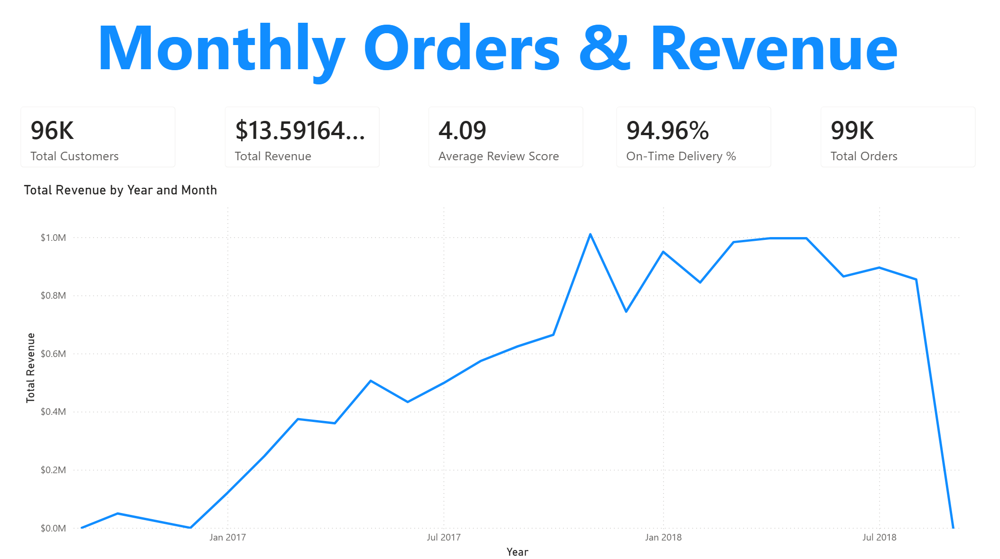
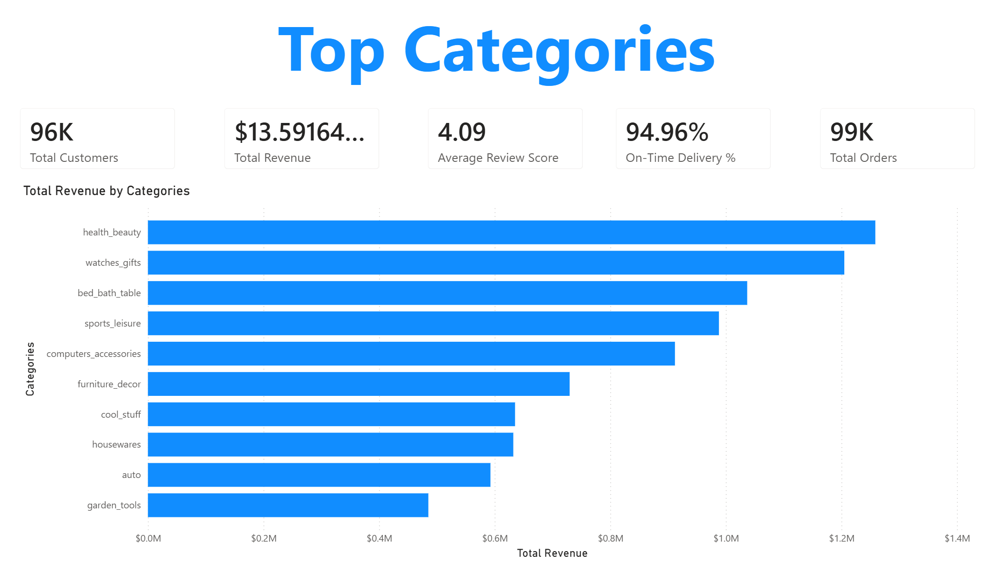
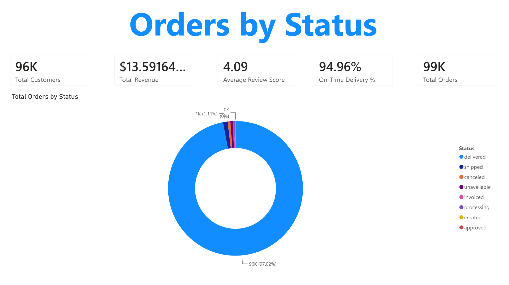
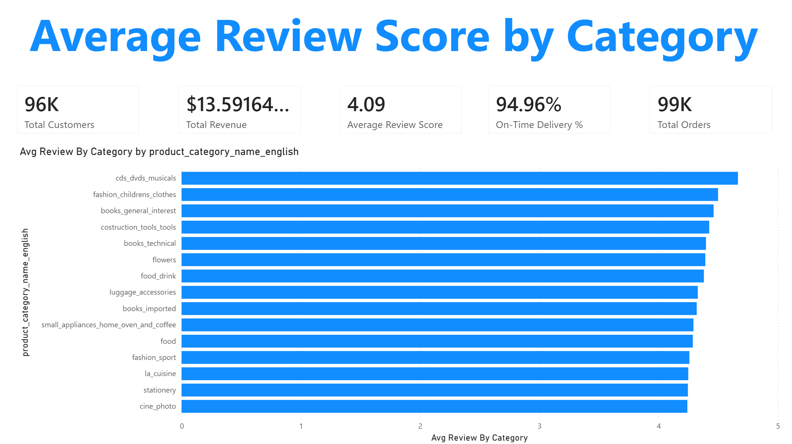
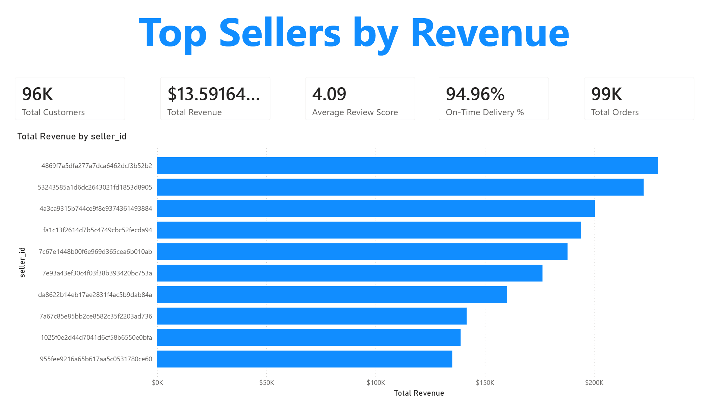
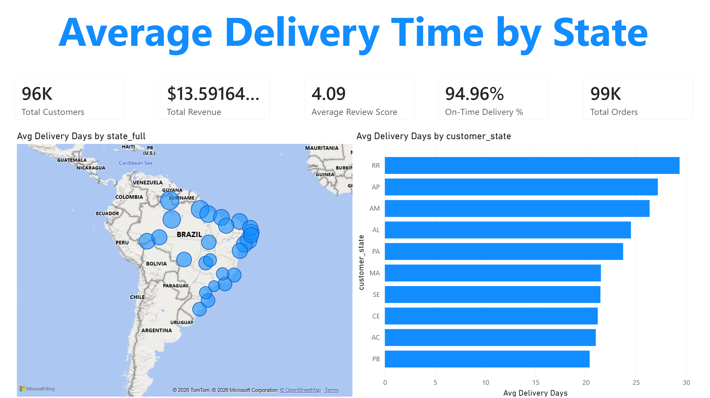
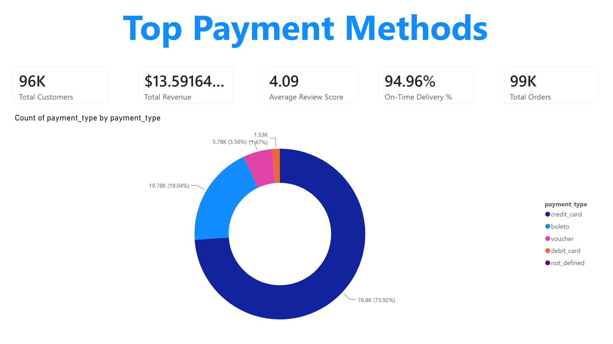
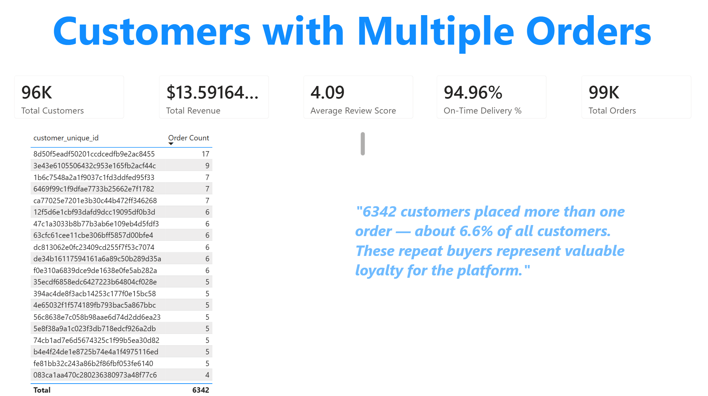
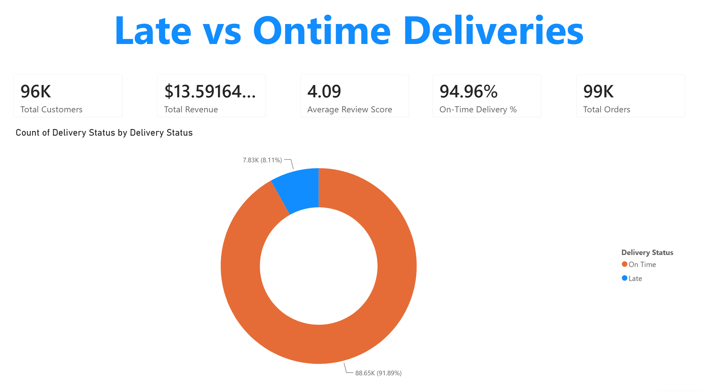
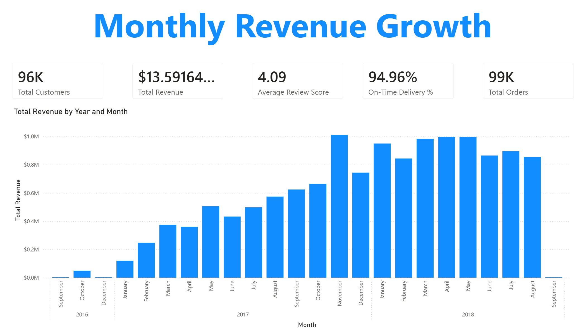

# Brazilian E-Commerce Analysis — SQL & Power BI

An end-to-end data analytics project built on the Olist Brazilian E-Commerce dataset. The project covers the full workflow: loading raw data into PostgreSQL, cleaning and validating it through a structured SQL pipeline, answering ten business questions with SQL, and presenting the results in an interactive Power BI dashboard connected live to the database.

---

## Project Overview

The dataset contains roughly 100,000 orders placed on the Olist marketplace between 2016 and 2018, spread across nine related tables (orders, order items, products, categories, customers, sellers, payments, reviews, and geolocation). The goal was to turn this raw, messy data into clean insights about revenue, product performance, delivery logistics, customer behavior, and payment trends.

**Tech stack:** PostgreSQL · SQL · Power BI · DAX · VS Code

---

## Repository Structure

```
.
├── sql_load/
│   ├── 1_create_database.sql
│   ├── 2_create_tables.sql
│   └── 3_modify_tables.sql
├── sql_cleaning/
│   ├── 1_remove_duplicates.sql
│   ├── 2_handle_nulls.sql
│   ├── 3_fix_categories.sql
│   ├── 4_standardize_text.sql
│   └── 5_validate_relationships.sql
├── sql_queries/
│   ├── 1_monthly_orders_and_revenue.sql
│   ├── 2_top_categories_by_revenue.sql
│   ├── 3_orders_by_status.sql
│   ├── 4_avg_review_score_by_category.sql
│   ├── 5_top_sellers_by_revenue.sql
│   ├── 6_avg_delivery_time_by_state.sql
│   ├── 7_payment_methods_analysis.sql
│   ├── 8_customers_with_multiple_orders.sql
│   ├── 9_late_vs_ontime_deliveries.sql
│   └── 10_monthly_revenue_growth.sql
├── assets/                         # dashboard screenshots
└── PortfolioProject_eCommerce.pbix # Power BI report
```

---

## Workflow

### 1. Data Loading

The nine CSV files were loaded into PostgreSQL using the `COPY` command. Because the raw data contained duplicate keys and inconsistent values, primary and foreign key constraints were dropped during loading and relationships were validated manually after cleaning instead.

### 2. Data Cleaning

A five-step cleaning pipeline was applied:

- **Remove duplicates** — duplicate rows were removed across all tables using the internal `ctid` row identifier and `ROW_NUMBER()` window functions. (The dataset had been loaded twice, so every table initially held double the correct row count.)
- **Handle nulls** — missing product categories were set to `'unknown'`, missing review titles and messages were filled with placeholder text, and missing order dates were intentionally left as `NULL` since they represent legitimately cancelled or undelivered orders.
- **Fix categories** — three product categories that existed in the products table but were missing from the categories reference table were added back, so no products are silently dropped in joins.
- **Standardize text** — city, category, status, and payment columns were normalized with `LOWER(TRIM())`, and state codes with `UPPER(TRIM())`, to prevent duplicate groupings caused by inconsistent casing or whitespace.
- **Validate relationships** — six orphan-record checks were run across all key relationships; all returned zero orphans, confirming referential integrity.

Final clean row counts: 99,441 orders · 99,441 customers · 98,410 reviews · 112,650 order items · 32,951 products · 3,095 sellers · 71 categories.

### 3. Visualization

Power BI was connected live to the PostgreSQL database. A data model was built linking the tables, and DAX measures were created for the core KPIs (total revenue, total orders, total customers, average review score, on-time delivery rate, and more). Each business question is presented on its own dashboard page, with a consistent KPI header and a dedicated visual.

---

## Analysis

Each of the ten business questions is broken down below with its purpose, the SQL techniques used, the key findings, and the matching dashboard page.

---

### Q1 — Monthly Orders & Revenue

**Analysis**
Tracks how many orders were placed and how much revenue was generated each month, revealing the platform's overall growth trajectory and seasonal patterns.

**SQL techniques**
`DATE_TRUNC` to group timestamps by month · `::DATE` cast to drop the time component · `COUNT(DISTINCT order_id)` to avoid counting order items as separate orders · `INNER JOIN` between orders and order_items · `GROUP BY` and `ORDER BY` on the truncated month.

**Key findings**
Revenue grew steadily from late 2016 through 2018, peaking in November 2017 with ~7,451 orders and roughly $1M in revenue — clearly driven by Black Friday. The earliest months (Sept–Dec 2016) show minimal activity, consistent with the platform's pilot phase.



---

### Q2 — Top Categories by Revenue

**Analysis**
Identifies which product categories generate the most revenue, showing where the platform's commercial strength lies.

**SQL techniques**
Three-table `JOIN` (products → order_items → categories) to bring English category names and prices together · `SUM` aggregation · `ORDER BY ... DESC` with `LIMIT 10` to return only the top performers.

**Key findings**
Health & Beauty leads with $1.26M, followed closely by Watches & Gifts ($1.21M) and Bed, Bath & Table ($1.04M). Revenue is fairly distributed across the top ten rather than dominated by a single category.



---

### Q3 — Orders by Status

**Analysis**
Breaks down all orders by their fulfillment status to gauge the operational health of the platform.

**SQL techniques**
Simple `GROUP BY` on `order_status` with `COUNT` · `ORDER BY` count descending to surface the most common statuses first.

**Key findings**
The vast majority of orders — 96,478 out of ~99,441 (about 97%) — were successfully delivered. Cancellations (625) and unavailable items (609) each represent under 1%, indicating a reliable fulfillment operation.



---

### Q4 — Average Review Score by Category

**Analysis**
Measures customer satisfaction at the category level by averaging review scores, highlighting which categories delight or disappoint customers.

**SQL techniques**
Four-table `JOIN` chain (reviews → order_items → products → categories) to connect a review score to a product category · `AVG` aggregation · `ROUND` for readability · `ORDER BY ... DESC` with `LIMIT 15`.

**Key findings**
The highest-rated categories are CDs/DVDs/Musicals (4.64) and Fashion Children's Clothes (4.50), with most top categories scoring between 4.2 and 4.5 — generally positive sentiment, with niche low-volume categories tending to score highest.



---

### Q5 — Top Sellers by Revenue

**Analysis**
Ranks the marketplace's highest-earning sellers to reveal how concentrated revenue is among top performers.

**SQL techniques**
Single-table aggregation on order_items · `SUM` of price grouped by `seller_id` · `ROUND` · `ORDER BY ... DESC` with `LIMIT 10`.

**Key findings**
The top seller generated over $229K, with the top ten falling in a relatively tight band from $135K to $229K — top revenue is spread across a competitive group rather than a single dominant seller.



---

### Q6 — Average Delivery Time by State

**Analysis**
Calculates the average number of days from purchase to delivery for each customer state, exposing logistics performance across Brazil's geography.

**SQL techniques**
Timestamp subtraction wrapped in `EXTRACT(DAY FROM ...)` to convert an interval into a day count · `AVG` and `ROUND` · `JOIN` between orders and customers · `WHERE order_delivered_customer_date IS NOT NULL` to exclude undelivered orders.

**Key findings**
São Paulo (SP) has the fastest deliveries at ~8.3 days, while the remote northern state of Roraima (RR) averages nearly 29 days — over three times slower. The pattern clearly reflects distance from the seller-dense southeast.



---

### Q7 — Payment Methods Analysis

**Analysis**
Examines which payment methods customers prefer and how many installments they use on average.

**SQL techniques**
`GROUP BY` on `payment_type` · `COUNT(*)` for usage frequency · `AVG(payment_installments)` with `ROUND` · `ORDER BY` count descending.

**Key findings**
Credit card dominates with 76,795 uses (~74% of payments) and is the only method with meaningful installments, averaging 3.51 — a reflection of Brazil's installment-based purchasing culture. Boleto, voucher, and debit card are always paid in a single installment.



---

### Q8 — Customers with Multiple Orders

**Analysis**
Finds customers who placed more than one order, identifying loyal repeat buyers — a key retention metric for any marketplace.

**SQL techniques**
`GROUP BY` on `customer_unique_id` (the true persistent customer identifier, rather than the per-order `customer_id`) · `JOIN` to the customers table · `HAVING COUNT(order_id) > 1` to filter after aggregation · `ORDER BY` count descending.

**Key findings**
Using the correct identifier reveals genuine repeat buyers, led by one customer with 17 orders, and 6,342 repeat customers in total. Repeat customers are relatively rare overall, pointing to a clear retention opportunity.



---

### Q9 — Late vs On-Time Deliveries

**Analysis**
Calculates the percentage of delivered orders that arrived late versus on time, a direct measure of delivery reliability.

**SQL techniques**
`CASE` expression to label each order as late or on-time by comparing actual vs estimated delivery dates · window function `SUM(COUNT(*)) OVER ()` to compute the grand total for the percentage · `* 100.0` to force decimal division · `CONCAT` to append a `%` sign · `WHERE` to exclude undelivered orders.

**Key findings**
91.89% of orders (88,649) arrived on or before the promised date, with only 8.11% (7,827) late. This strong performance suggests Olist sets realistic delivery estimates that account for long distances rather than missing aggressive deadlines.



---

### Q10 — Monthly Revenue Growth

**Analysis**
Measures month-over-month revenue growth as a percentage, showing how the business accelerated and stabilized over time.

**SQL techniques**
Common Table Expression (`WITH`) to first compute monthly revenue · `LAG()` window function to pull the previous month's revenue onto each row · a growth formula `(current - previous) * 100.0 / previous` · `WHERE` filter from 2017 onward to remove the distorted low-volume pilot months · `CONCAT` for percentage formatting.

**Key findings**
Growth peaked in November 2017 at +52% (Black Friday), followed by the typical December dip (-26%). Throughout 2018 the swings narrowed to a more stable range, a sign of a platform maturing from explosive early growth into steady operation.



---

## Project Outcomes

- Transformed a raw, duplicated, and inconsistent nine-table dataset into a clean, validated database ready for analysis.
- Built a reusable five-stage SQL cleaning pipeline covering duplicates, nulls, reference integrity, text standardization, and relationship validation.
- Answered ten business questions with SQL ranging from basic aggregations to window functions (`LAG`, `SUM() OVER ()`) and CTEs.
- Connected Power BI live to PostgreSQL, built a relational data model, and authored DAX measures for all core KPIs.
- Delivered a ten-page interactive dashboard, one page per question, with a consistent KPI header and a dedicated visual for each analysis.

---

## Conclusion

This project demonstrates a complete analytics workflow on a realistic, messy dataset: from raw CSV ingestion and rigorous cleaning, through SQL-based analysis, to an interactive Power BI dashboard. The findings paint a clear picture of the Olist marketplace — strong and growing revenue led by health, beauty, and gift categories; high customer satisfaction; reliable on-time delivery despite Brazil's challenging geography; a strong cultural preference for credit-card installments; and a clear opportunity to improve customer retention. Together, the SQL and Power BI components turn raw transactional data into actionable business insight.

---

## Dataset

Olist Brazilian E-Commerce Public Dataset, available on Kaggle. It contains anonymized order, product, customer, seller, payment, and review data from the Brazilian marketplace Olist.